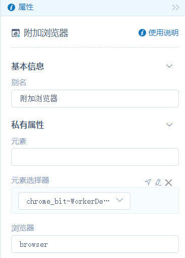
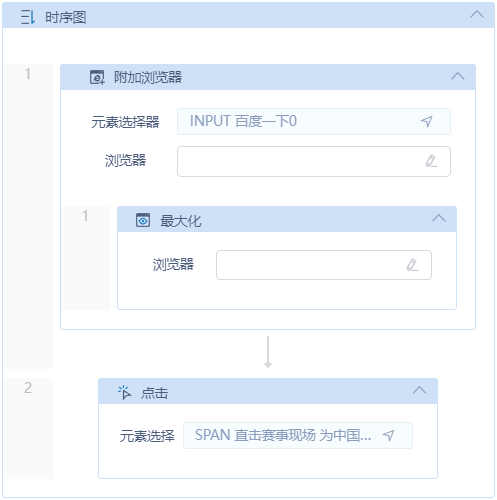
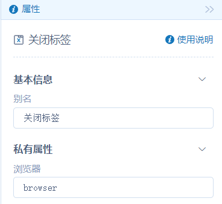
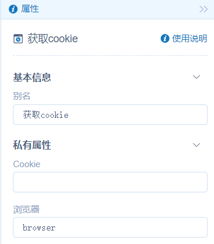

# 测试活动文档

活动使用指南

**bit-Worker**

**3.2 组件库**

**目 录**

界面自动化 5

浏览器 5

附加浏览器 5

关闭标签 7

获取 cookie 8

# 界面自动化

## 浏览器

### 附加浏览器

**视频**

待

**活动说明**

对已打开网页的指定元素新建一个附加浏览器的活动范围。在其拖入浏览器相关活动可以不使用变量指定浏览器

**属性说明**

**元素**

选择一个网页元素的变量

**元素选择器**

- 从元素集中选择一个已捕获的元素，根据该元素匹配相应网页
- 点击【捕获】图标捕获一个新元素，根据该元素匹配相应网页

**浏览器**

将活动运行后所匹配到的网页输出为变量，后续流程可直接调用该变量

**使用示例**

**执行步骤：**通过元素匹配到相应网页--将网页最大化--点击网页内主题链接，进入主题页面

### 关闭标签

**活动说明**

关闭浏览器标签

**属性说明**

**浏览器**

将活动运行后所匹配到的网页输出为变量，后续流程可直接调用该变量

**使用示例**

**执行步骤：**通过元素匹配到相应网页--将网页最大化--点击网页内主题链接，进入主题页面

### 获取 cookie

活动说明：获取浏览器 Cookie 信息。

| **参数说明**     | **属性名**  | **默认值**  | **数据类型**  | **是否必填**  |
| --------------------- | ---------------- | ---------------- | ------------------ | ------------------ |
| 输出参数 1       | Cookie      | -           | String        | 是            |
| 输入/输出参数 1  | 浏览器      | -           | IBrowser      | 是            |

